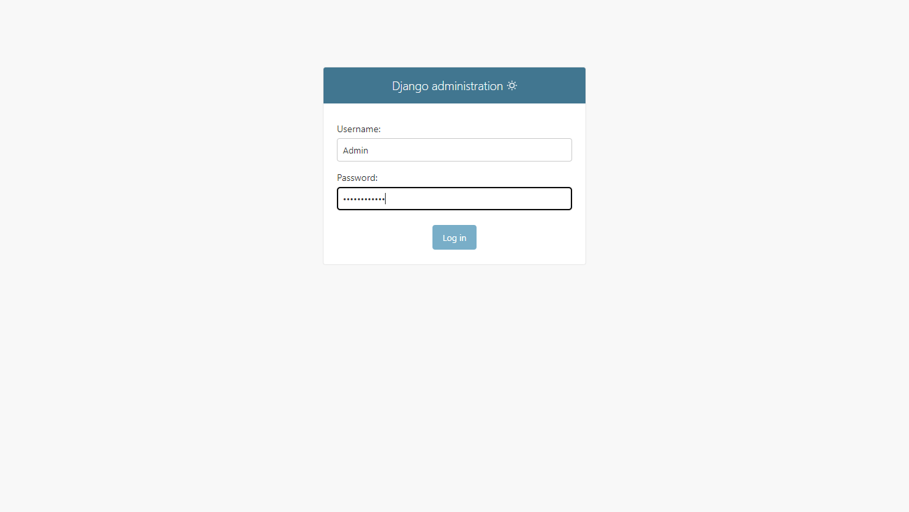

<h1 align="center">S-manage :Système de gestion de Projet</h1>
<h2 align="center">Prérequis</h2>
- python3.10
- django 4.2
- mysql workbrench

<h2 align="center">Installation</h2>
Rendez Vous sur le compte github : agodaMarina
ou cloner directerment le projet via ce lien [lienPourClonerLeProjet](https://github.com/agodaMarina/projetDjango.git)

<h2 align="center">Guide d'utilisation</h2>
<h3 align="left">Administrateur</h3>
l'administrateur se connecte et accède a son panel via ces identifiants
username:Admin
mot de passe: @Esskp_2003M

Etudiant:

Enseignant:
